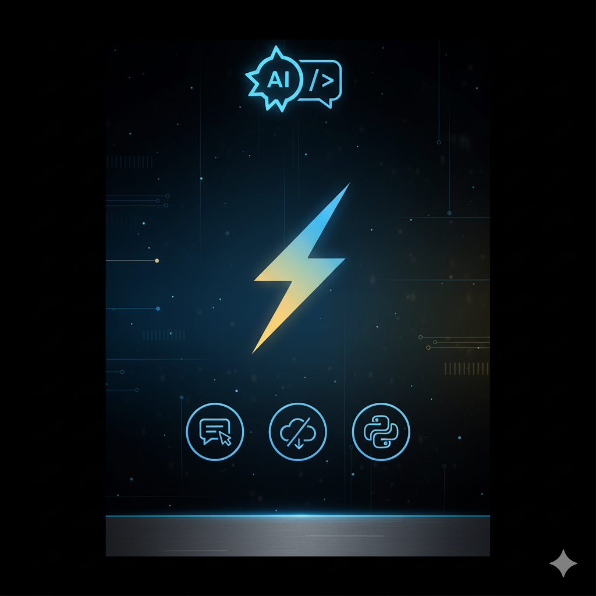

# 🧠 SmartPitch UI  
**Lightweight Outreach Generator for Freelancers & Builders**



---

## 💡 What is SmartPitch UI?

SmartPitch UI is a **simple web-based pitch generator** for freelancers, solopreneurs, and indie builders who want to create cold messages fast — without using an API or external AI service.

This version is a UI upgrade of our original CLI tool: [SmartPitch CLI](https://github.com/PRINCEROHAN22/smartpitch-cli).

You can:
- ✅ Enter your name, target client name, and service type
- ✅ Instantly generate a pitch using pre-made templates
- ✅ Copy the pitch and customize it as needed

---

## ✨ Features

- 🖥 Clean, browser-based form interface (Flask + HTML)
- ⚡ Instant cold DM creation — no wait, no API
- 🔒 Offline, privacy-safe: no data is stored
- 🛠 Simple, editable template system
- 💡 Great for first-time freelancers testing outreach

---

## 🚀 Quickstart

> Make sure you have Python 3.8+ installed.

1. Clone this repo:
```bash
git clone https://github.com/PRINCEROHAN22/smartpitch-ui.git

2. Install Flask:
pip install flask

3.Run the app:
python app.py

4.Open your browser and go to:
http://localhost:5000

📸 Preview


🌱 Inspiration

This was built to support early freelancers in crafting professional cold pitches, even with zero tech or copywriting skills.

It simulates a basic “AI-like” generation approach, using structured input and smart templates — a stepping stone before fully automated tools.

🔮 Future Upgrades (Planned)

 Add AI-based pitch generation via OpenAI API (optional)

 Save and edit pitches

 Download to PDF or Notion

 More pitch styles and tones (playful, formal, urgent, etc.)

👑 Made with ❤️ by Eva & Rohan Digital Systems

💌 Connect with us: https://www.linkedin.com/in/prince-rohan-j-6265a1218

📦 Other tools & services: https://evandrohan.gumroad.com/
